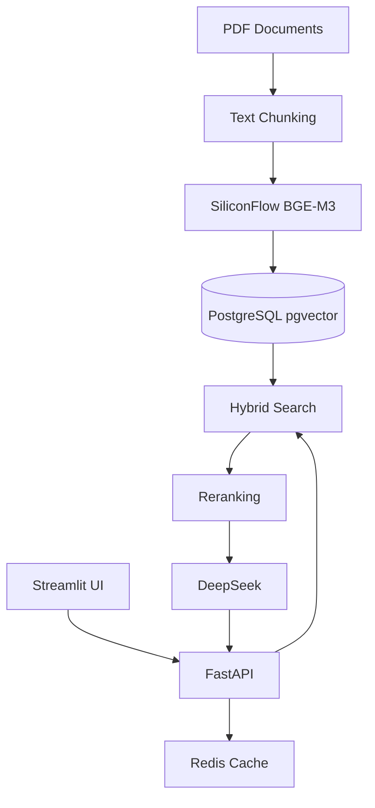

# RAG Architecture

```mermaid
flowchart TD
 A[PDF Documents] --> B[Text Chunking]
 B --> C[SiliconFlow BGE-M3]
 C --> D[(PostgreSQL pgvector)]
 E[Streamlit UI] --> F[FastAPI]
 F --> G[Redis Cache]
 F --> H[Hybrid Search]
 D --> H
 H --> I[Reranking]
 I --> J[DeepSeek]
 J --> F
```
